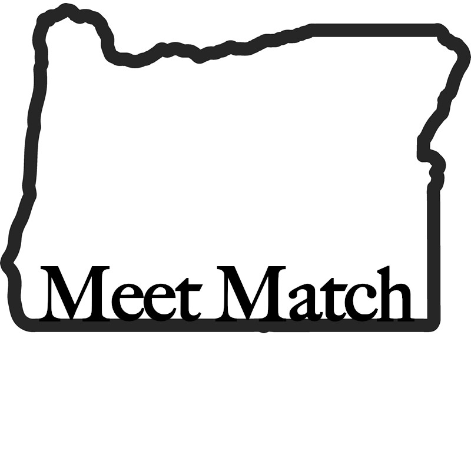
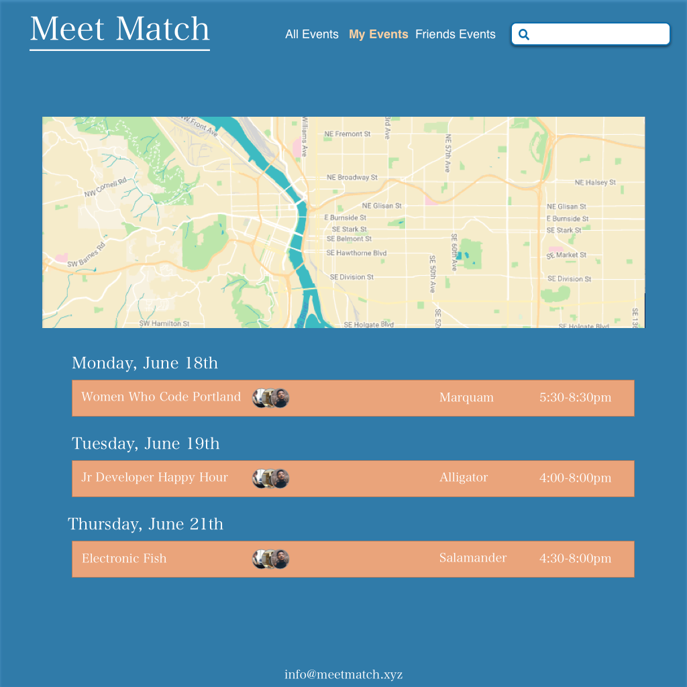

## Motivation
A group project to demonstrate backend and front end development skills. Meet-ups are something we enjoy as tech newbs. An app like this would help friends find each other when looking for relevant meet-ups.

## Screenshots

## Getting Started
 * clone or download from this repository

### Prerequisites
API keys from Meetup and Google Maps

### Installing

* run npm install
* obtain API keys from Meetup and Google Maps

## Development server

Run `ng serve` for a dev server. Navigate to `http://localhost:4200/`. The app will automatically reload if you change any of the source files.

## Code scaffolding

Run `ng generate component component-name` to generate a new component. You can also use `ng generate directive/pipe/service/class/module`.

## Build

Run `ng build` to build the project. The build artifacts will be stored in the `dist/` directory. Use the `-prod` flag for a production build.

## Running unit tests

Run `ng test` to execute the unit tests via [Karma](https://karma-runner.github.io).

## Running end-to-end tests

Run `ng e2e` to execute the end-to-end tests via [Protractor](http://www.protractortest.org/).
Before running the tests make sure you are serving the app via `ng serve`.

## Further help

To get more help on the Angular CLI use `ng help` or go check out the [Angular CLI README](https://github.com/angular/angular-cli/blob/master/README.md).

## Deployment

This is a thing that can happen.

## Built With
* [Angular CLI](https://github.com/angular/angular-cli) version 1.0.0
* [Spark](http://www.dropwizard.io/1.0.2/docs/) - The web framework used
* [Gradle](https://maven.apache.org/) - Dependency Management
* [GSON](https://rometools.github.io/rome/) - Used to generate RSS Feeds

## Features
A friend finding component to a meet-up site- friends show up as map markers.

## Authors

* **Johnny Alt** - *Angular, server API* - [johnnyrayalt](https://github.com/johnnyrayalt)
* **Pablo Barreyro** - *Angular* - [Pabarreyro](https://github.com/Pabarreyro)
* **Sean McDermott** - *UI/UX* - [seanulus](https://github.com/seanulus)
* **Dawn Mott** - *UI/UX* - [Dawnabelle](https://github.com/Dawnabelle) :sunrise_over_mountains:

## License

This project is licensed under the MIT License - see the [LICENSE.md](LICENSE.md) file for details

## Acknowledgments

Staff and fellow students for support and encouragement
